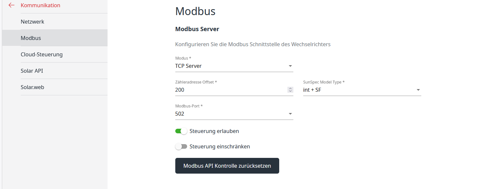

# Fronius Modbus TCP PHP


A lightweight PHP library for interacting with **Fronius inverters and smart meters via Modbus TCP**.


It allows you to:

* Read **battery status**
* Control **battery charge/discharge**
* Read **grid power from smart meters**
* Build custom **energy automation scripts**

The library communicates directly with the inverter using **Modbus TCP** and requires no external dependencies.

---

# Features

* Read battery status (SOC, reserve, limits, power)
* Force battery **charging or discharging**
* Restore **automatic battery control**
* Read **grid import/export power**
* Support for **multiple smart meters**
* Simple **pure PHP implementation**

---

# Supported Devices

The library was developed for **Fronius GEN24 inverters** and Fronius smart meters.

Examples:

* Fronius GEN24
* Fronius Symo GEN24 / Primo Gen24 / Verto / Tauro
* Fronius smart meters

The battery power reading currently works **best with GEN24 systems**.

---

# Requirements

* PHP 7.4+ (PHP 8 recommended)
* Fronius inverter with **Modbus TCP enabled**
* Network access to the inverter

Default Modbus settings:

```
Port: 502
Inverter Slave ID: 1
Smart Meter Slave ID: 200
```

---

Configuration on Fronius inverter:



# Installation

Clone the repository:

```bash
git clone https://github.com/YOUR_USERNAME/fronius-modbus-tcp-php.git
```

Or copy the files into your project.

No external dependencies are required.

---

# Project Structure

```
ModbusTCPClient.php
ModbusTCPClientInverter.php
ModbusTCPClientSmartmeter.php
BatteryStatus.php
example.php
```

---

# Basic Usage

## Connect to inverter and read battery status

```php
use fronius_modbus_tcp_php\src\ModbusTCPClientInverter;
use fronius_modbus_tcp_php\src\ModbusTCPClientSmartmeter;

// Include the library files manually
include_once __DIR__ . '/src/ModbusTCPClient.php';
include_once __DIR__ . '/src/ModbusTCPClientInverter.php';
include_once __DIR__ . '/src/ModbusTCPClientSmartmeter.php';
include_once __DIR__ . '/src/BatteryStatus.php';


$client = new ModbusTCPClientInverter("192.168.0.65");

$client->connect();

$status = $client->getBatteryStatus();

print_r($status->toArray());

$client->close();
```

Example output:

```
Array
(
    [maxPowerW] => 4300
    [stateOfCharge] => 92.92
    [reservePercent] => 6
    [chargeLimitPercent] => 100
    [dischargeLimitPercent] => 100
    [revertTimeout] => 0
    [gridChargingEnabled] => 1
    [controlMode] => 0
    [batteryPower] => 860.8
    [chargeStatus] => charging
)

```

---

# Force Battery Charging

```php
$client->forceBatteryCharge(4000); // charge with ~4kW
```

---

# Force Battery Discharging

```php
$client->forceBatteryDischarge(3000); // discharge with ~3kW
```

---

# Restore Automatic Mode

```php
$client->autoMode();
```

---

# Read Grid Power from Smart Meter

```php
use battery\fronius_modbus_tcp_php\src\ModbusTCPClientSmartmeter;

$meter = new ModbusTCPClientSmartmeter("192.168.0.65");

$meter->connect();

$power = $meter->getRealPower();

var_dump($power);

$meter->close();
```

Power interpretation:

```
Positive value  → importing power from grid
Negative value  → exporting power to grid
```

Example:

```
1200  → importing 1.2 kW
-800  → exporting 800 W
```

---

# Read Secondary Smart Meter

Some systems have multiple meters.

```php
$meter = new ModbusTCPClientSmartmeter("192.168.0.65", 502, 201);
```

---

# BatteryStatus Object

`getBatteryStatus()` returns a `BatteryStatus` object containing:

| Property              | Description                      |
| --------------------- | -------------------------------- |
| maxPowerW             | Maximum charge power             |
| stateOfCharge         | Battery SOC (%)                  |
| reservePercent        | Configured reserve               |
| chargeLimitPercent    | Charge limit                     |
| dischargeLimitPercent | Discharge limit                  |
| revertTimeout         | Timeout before reverting to auto |
| gridChargingEnabled   | Grid charging enabled            |
| controlMode           | Battery control mode             |
| batteryPower          | Current battery power            |
| chargeStatus          | Human readable status            |

---

# Example Automation Use Cases

This library can be used for:

* **PV surplus battery charging**
* **Grid price optimization**
* **Home automation integration**
* **Energy monitoring dashboards**
* **custom Home Assistant integrations**

---

# Limitations

* Battery power reading currently optimized for **GEN24**
* No asynchronous Modbus support
* Basic error handling

---

# License

MIT License

---

# Contributions

Contributions are welcome!

If you find issues or want to add support for additional Fronius devices, feel free to open a **pull request or issue**.

---

